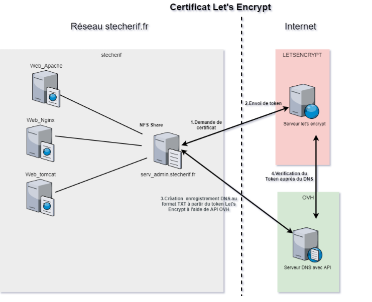

**Automatisation de renouvellement de certificat  SSL avec let's encrypt**
## Présentation de Let's Encrypt
L’objectif de Let’s Encrypt et du protocole ACME **(Automatic Certificate Management Environment)**  est de permettre la mise en place d’un serveur HTTPS et l’obtention automatique d’un certificat de confiance, reconnu nativement par les navigateurs, sans intervention humaine. Ceci est accompli en exécutant un agent de gestion de certificat sur le serveur Web.

Let’s Encrypt est une autorité de certification (AC ou CA pour Certificate Authority en anglais) gratuite, automatisée et ouverte, exploitée pour le bénéfice du public. C’est un service fourni par Internet Security Research Group (ISRG). Let's Encrypt donne aux gens les certificats numériques dont ils ont besoin pour activer HTTPS (SSL/TLS) pour les sites Web, gratuitement, de la manière la plus intuitive possible. Usuellement les certificats Let's Encrypt sont issue en utilisant une validation HTTP qui permet une installation rapide du certificat pour un serveur unique. Cette méthode n'est pas valable pour la génération d'un certificat wildcard pour cela nous avons eu recours à la méthode DNS validation/Défi DNS-01.

Le défi vous demande de prouver que vous contrôlez le DNS pour votre nom de domaine en placant une valeur spécifique dans un enregistrement de type TXT sous ce nom de domaine. Il vous permet également d’émettre des certificats génériques. Après que Let’s Encrypt ai donné un jeton à votre client ACME, celui-ci va créer un enregistrement TXT dérivé de ce jeton et de votre clef de compte, via une entrée DNS se nommant _acme-challenge. <YOUR_DOMAIN>. Alors Let’s Encrypt interrogera le système DNS pour cet enregistrement. S’il trouve une correspondance, vous pouvez réaliser la délivrance d’un certificat!
Étant donné que l’automatisation de l’émission et du renouvellement est très importante, il est logique d’utiliser les défis DNS-01 si le fournisseur DNS dispose d’une API qu’il met à disposition pour automatiser les mises à jour. OVH qui est notre fournisseur DNS dispose de cette API DNS-API
<div align="center">
    
</div>
Comme décrit dans le schéma précèdent nous avons installé le client ACME sur un serveur dédie qui s'appelle serv_admin.stecherif.fr
Dans ce qui suit nous allons détailler les différentes étapes pour la mise en place de la solution


## Préparation et installation du serveur serv_admin.stecherif.fr
### 1-\ Prérequis
> sudo apt update && apt upgrade

Dans un premier lieu il faut s'assurer que python3 est installé (python2.7 génère plusieurs problèmes de dépendance)

> sudo apt install python3-pip 

### 2-\ Installation client ACME Certbot
> sudo pip3 install certbot
> sudo pip3 install --upgrade pip
> sudo pip3 install cryptography --upgrade
> sudo pip3 install certbot-dns-ovh

### 3-\ Configuration de Certbot
Certbot stocke son logs sous /var/log/letsencrypt. Pour éviter d'avoir un énorme log on définit une stratégie de rotation de log.Cette stratégies consiste à effacer les logs âgées de plus de 6 mois.
> sudo nano /etc/logrotate.d/certbot
```
/var/log/letsencrypt/*.log {
   monthly
   rotate 6
   compress
   delaycompress
   notifempty
   missingok
   create 640 root adm
}
```
### 4-\ Authentification API OVH pour Defi-DNS01

Comme expliqué dans la Présentation de Let's Encrypt pour avoir le certificat l'AC doit s'assurer qu'on détient le nom de Domain en proposant un défi.
Avec le défi-DNS nous devons ajouté un enregistrement DNS du type TXT pour prouver le contrôle du nom du domaine.
Le plugin dns_ovh automatise le processus de réalisation d'un challenge DNS01 en créant puis en supprimant des enregistrements TXT à l'aide de l'API OVH.


L'utilisation de ce plugin nécessite un fichier de configuration contenant les identifiants de l'API OVH pour un compte avec les règles d'accès suivantes :
```
GET /domain/zone/*
PUT  /domain/zone/* 
POST  /domain/zone/* 
DELETE  /domain/zone/*
```
Ces identifiants peuvent y être obtenus :
OVH Europe
Le résultat de l’API est le suivant :
<div align="center">
    
</div>


1. Inventaire des serveurs (distribution linux redhat,debian, centos, ubuntu)
2. Inventaire des serveurs web installé (apache, nginx et tomcat)
3. Vérification des fichiers de conf des serveurs web
4. Installation de Certbot sur serveur dédié pour permettre la demande du certificat wildcard au nom du domaine 
5. Création du  fichier de configuration contenant les identifiants de l'API OVH afin d'automatiser le processus de réalisation d'un challenge DNS01 en créant puis en supprimant des enregistrements TXT à l'aide de l'API OVH
6. Planification de la génération et du renouvellement des certificats let's encrypt avec crontab 
7. Création d'un partage avec les certificat et montage du nouveau partage sur les serveurs web pour éviter de redistribuer les certificats
8. Redémarrage du service sur chaque serveur web
9. Rédaction de la documentation qui explique les differentes étapes de la réalisation du projet


