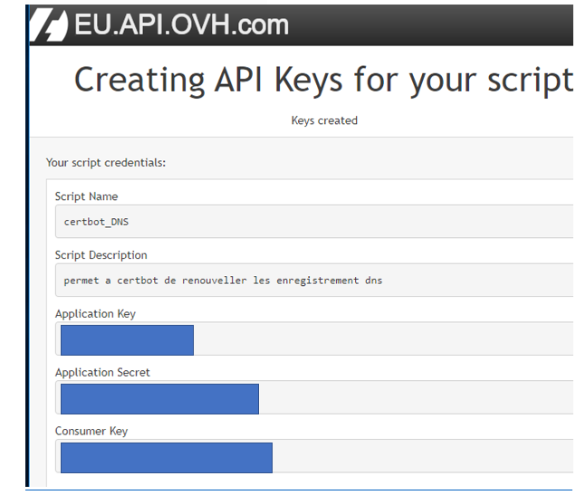
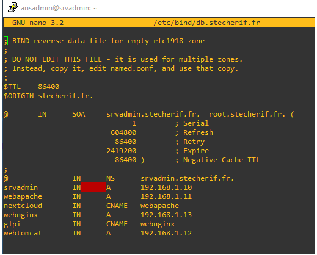
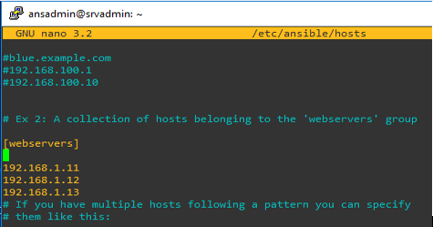

# Automatisation de renouvellement de certificat  SSL avec let's encrypt

## Présentation de Let's Encrypt
L’objectif de Let’s Encrypt et du protocole ACME **(Automatic Certificate Management Environment)**  est de permettre la mise en place d’un serveur HTTPS et l’obtention automatique d’un certificat de confiance, reconnu nativement par les navigateurs, sans intervention humaine. Ceci est accompli en exécutant un agent de gestion de certificat sur le serveur Web.

Let’s Encrypt est une autorité de certification (AC ou CA pour Certificate Authority en anglais) gratuite, automatisée et ouverte, exploitée pour le bénéfice du public. C’est un service fourni par Internet Security Research Group (ISRG). Let's Encrypt donne aux gens les certificats numériques dont ils ont besoin pour activer HTTPS (SSL/TLS) pour les sites Web, gratuitement, de la manière la plus intuitive possible. Usuellement les certificats Let's Encrypt sont issue en utilisant une validation HTTP qui permet une installation rapide du certificat pour un serveur unique. Cette méthode n'est pas valable pour la génération d'un certificat wildcard pour cela nous avons eu recours à la méthode DNS validation/Défi DNS-01.

Le défi vous demande de prouver que vous contrôlez le DNS pour votre nom de domaine en placant une valeur spécifique dans un enregistrement de type TXT sous ce nom de domaine. Il vous permet également d’émettre des certificats génériques. Après que Let’s Encrypt ai donné un jeton à votre client ACME, celui-ci va créer un enregistrement TXT dérivé de ce jeton et de votre clef de compte, via une entrée DNS se nommant _acme-challenge. <YOUR_DOMAIN>. Alors Let’s Encrypt interrogera le système DNS pour cet enregistrement. S’il trouve une correspondance, vous pouvez réaliser la délivrance d’un certificat!
Étant donné que l’automatisation de l’émission et du renouvellement est très importante, il est logique d’utiliser les défis DNS-01 si le fournisseur DNS dispose d’une API qu’il met à disposition pour automatiser les mises à jour. OVH qui est notre fournisseur DNS dispose de cette API DNS-API
<div align="center">
    
</div>
Comme décrit dans le schéma précèdent nous avons installé le client ACME sur un serveur dédie qui s'appelle serv_admin.stecherif.fr
Dans ce qui suit nous allons détailler les différentes étapes pour la mise en place de la solution


## Préparation et installation du serveur serv_admin.stecherif.fr
### 1-\ Prérequis
> sudo apt update && apt upgrade

Dans un premier lieu il faut s'assurer que python3 est installé (python2.7 génère plusieurs problèmes de dépendance)

> sudo apt install python3-pip 

### 2-\ Installation client ACME Certbot
> sudo pip3 install certbot
> sudo pip3 install --upgrade pip
> sudo pip3 install cryptography --upgrade
> sudo pip3 install certbot-dns-ovh

### 3-\ Configuration de Certbot
Certbot stocke son logs sous /var/log/letsencrypt. Pour éviter d'avoir un énorme log on définit une stratégie de rotation de log.Cette stratégies consiste à effacer les logs âgées de plus de 6 mois.
> sudo nano /etc/logrotate.d/certbot
```
/var/log/letsencrypt/*.log {
   monthly
   rotate 6
   compress
   delaycompress
   notifempty
   missingok
   create 640 root adm
}
```
### 4-\ Authentification API OVH pour Defi-DNS01

Comme expliqué dans la Présentation de Let's Encrypt pour avoir le certificat l'AC doit s'assurer qu'on détient le nom de Domain en proposant un défi.
Avec le défi-DNS nous devons ajouté un enregistrement DNS du type TXT pour prouver le contrôle du nom du domaine.
Le plugin dns_ovh automatise le processus de réalisation d'un challenge DNS01 en créant puis en supprimant des enregistrements TXT à l'aide de l'API OVH.


L'utilisation de ce plugin nécessite un fichier de configuration contenant les identifiants de l'API OVH pour un compte avec les règles d'accès suivantes :
```
GET /domain/zone/*
PUT  /domain/zone/* 
POST  /domain/zone/* 
DELETE  /domain/zone/*
```
Ces identifiants peuvent y être obtenus :
OVH Europe
Le résultat de l’API est le suivant :
<div align="center">
    
</div>
Définissons maintenant le fichier .ovhapi qui contient les identifiants de l'API OVH utilisés par Certbot.
> nano .ovhapi

Le fichier contient les éléments suivants:
```
dns_ovh_endpoint = ovh-eu
dns_ovh_application_key  = xxxxxxxxxxxxxxxxxxxx
dns_ovh_application_secret  = xxxxxxxxxxxxxxxxxxxxx
dns_ovh_consumer_key  = xxxxxxxxxxxxxxxxxxxxxxxxx
```
> chmod 600 .ovhapi

### 5-\ Génération du certificat SSL Wildcard

La génération des certificats se fait comme suit :
> sudo certbot certonly   --dns-ovh   --dns-ovh-credentials ~/.ovhapi   -m xxxxxxxxx@gmail.com   -d *.stecherif.fr   --dns-ovh-propagation-seconds 300   --agree-tos

Pour Vérifier les certificats crées il suffit de :
> sudo ls /etc/letsencrypt/live/stecherif.fr/

### 6-\ Script Crontab pour la génération de certificats SSL Wildcard
Nous allons utiliser crontab afin de pouvoir renouveler nos certificats automatiquement tous les deux mois.
En premier lieu commençant par créer notre script bash renovCerts.sh
> mkdir /letsencrypt
> nano /letsencrypt/renovCerts.sh

Le contenu du script est le suivant :
```
#!/bin/bash
 certbot certonly   --dns-ovh   --dns-ovh-credentials ~/.ovhapi   -m xxxxxxxx@gmail.com   -d *.stecherif.fr   --dns-ovh-propagation-seconds 300  --agree-tos  --non-interactive
chmod +x /letsencrypt/renovCerts.sh
```

### 7-\ Expiration et Renouvellement
Pour vérifier la validité du certificat il suffit de taper la commande suivante:
> cd /etc/letsencrypt/live/stecherif.fr/ 
> openssl x509 -dates -noout < cert.pem

### 8-\ Validité du certificat actuel  : 24 Novembre 2021
> notBefore=Aug 26 13:56:16 2021 GMT
> notAfter=Nov 24 13:56:15 2021 GMT 

### 9-\ Renouvellement
Comme décrit précédemment le renouvellement des certificats est planifié par une tache cron. Cette tâche doit s'exécuter le 23 des mois Fevrier, Mai, Aout, Novembre à 09h30
crontab -e
> 30 09 23 Feb,May,Aug,Nov * /letsencrypt/renovCerts.sh > renovCerts.log 2>&1
En cas où on a besoin de renouveler manuellement il suffit d'exécuter la commande suivante :
> certbot certonly   --dns-ovh   --dns-ovh-credentials ~/.ovhapi   -m xxxxxxxx@gmail.com   -d *.stecherif.fr   --dns-ovh-propagation-seconds 300  --agree-tos  --non-interactive

puis copier le contenu de /etc/letsencrypt/archive/stecherif.fr dans /etc/ssl/certs/stecherif/
> cp -R /etc/letsencrypt/archive/stecherif.fr/* /etc/ssl/certs/stecherif/

### 10-\ Copie automatique des certificats vers le dossier de partage
Ce script python permet de vérifier les derniers certificats créer par letsencrypt les copier et les coller vers le dossier de partage
```
#!/usr/bin/env python
# ce script  permet de parcourir le dossier des certificats letsencrypt et de verifier si il ya un certificat generer la copier et la coller dans le dossier de partage
# importing the required modules
import  os, os.path, time
from datetime import datetime
import shutil

files = os.listdir("/etc/letsencrypt/archive/stecherif.fr")

x= datetime.today().strftime('%Y-%m-%d')
#print(x)


for filename in files:
        file = "/etc/letsencrypt/archive/stecherif.fr/"+ filename
        y= time.strftime('%m/%d/%Y', time.gmtime(os.path.getmtime(file)))
        y=y[-4:]+"-"+y[0:2]+"-"+y[3:5]
        if x == y:
                if filename[0] == "f":
                        #print(filename)
                        destination="/etc/ssl/certs/stecherif/fullchain1.pem"
                        shutil.copyfile(file, destination)
                if filename[0] == "p":
                        #print(filename)
                        destination="/etc/ssl/certs/stecherif/privkey1.pem"
                        shutil.copyfile(file, destination)
```
Ce script est lancé par un cron après la création des certificats ce script va être lancer automatiquement :
> 00 10 23 Feb,May,Aug,Nov * /script_python/copy_file.py
## Les services et les scripts mis en place sur le Serveur Admin 
### 1-\ Le service DNS 
J’ai installé et configuré le service DNS  Bind9 dans ce serveur et j’ai crée les enregistrements DNS comme le montre la figure ci-dessous
<div align="center">
    
</div>

### 2-\ l’outil d’automatisation Ansible :
#### a-\ Configuration et installation de Ansible
> apt update
> apt install ansible 
> sudo useradd ansdmin 
> sudo passwd devops 
> sudo nano /etc/sudoers
```
ansadmin        ALL=(ALL:ALL) AL
```
**Coté client :**
> sudo useradd ansdmin 
> sudo passwd devops 
> sudo nano /etc/sudoers
```
ansadmin        ALL=(ALL:ALL) ALL
```
> sudo nano /etc/ssh/sshd_config 
```
#PasswordAuthentication no 
PasswordAuthentication yes 
```
> sudo systemctl reload sshd

> su - ansadmin 
> [ansadmin@srvadmin ~]$ ssh-keygen

> ansadmin@srvadmin ~]$ ssh-copy-id -i /home/ansadmin/.ssh/id_rsa.pub ansadmin@192.168.1.11

> ansadmin@srvadmin ~]$ ssh-copy-id -i /home/ansadmin/.ssh/id_rsa.pub ansadmin@192.168.1.12

> ansadmin@srvadmin ~]$ ssh-copy-id -i /home/ansadmin/.ssh/id_rsa.pub ansadmin@192.168.1.13

> sudo nano /etc/ansible/hosts
<div align="center">
    
</div>

#### b-\ création de playbook 
##### 1)	Afficher les informations concernant les machines clientes :
nano display_informations.yml


1. Inventaire des serveurs (distribution linux redhat,debian, centos, ubuntu)
2. Inventaire des serveurs web installé (apache, nginx et tomcat)
3. Vérification des fichiers de conf des serveurs web


